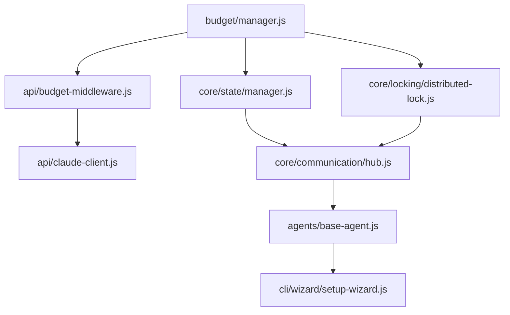

# Implementation Report: Implement the proposal.

**Generated:** 2025-10-06T19:50:30.978Z
**Session ID:** 1759779932432-p9pss7sv0
**Complexity:** 4/10
**Agents Used:** 9
**Mode:** Implementation from Proposal

---

## ⚠️ Implementation Deviations from Original Spec

**Date:** 2025-10-07
**Reason:** Critical bug fixes and architectural improvements

### Deviation 5: Hierarchical Two-Tier Coordination (2025-10-06)

**Problem:** Main coordinator was spending 3-5 minutes planning complex projects with 40+ tasks:
- Single coordinator agent creating all detailed tasks upfront
- Large prompt/response for complex proposals (16000+ tokens)
- Planning bottleneck before any work begins
- No parallelization during planning phase

**Root Cause:** Single-tier coordination doesn't scale:
- Main coordinator must understand every implementation detail
- Cannot parallelize planning across multiple features
- One agent doing both strategic and tactical planning

**Architecture Change:**

**Two-Tier Hierarchy:**
```
Main Coordinator (Strategic)
  ├─ Creates high-level features (5-15 features)
  ├─ Defines feature dependencies
  └─ Spawns Feature Coordinators in parallel
       ↓
Feature Coordinators (Tactical) - Run in parallel
  ├─ Feature-001-Coordinator → Creates 3-6 file-level tasks
  ├─ Feature-002-Coordinator → Creates 4-8 file-level tasks
  └─ Feature-003-Coordinator → Creates 2-5 file-level tasks
       ↓
Worker Agents (Implementation)
  ├─ Backend Agent
  ├─ Frontend Agent
  ├─ Database Agent
  └─ ...
```

**Implementation Details:**

1. **Main Coordinator** (`src/agents/coordinator-agent.js`):
   - `analyzeProposal()` now creates `features` array instead of `tasks`
   - Each feature is a high-level module (e.g., "Authentication System", "Database Layer")
   - `_planFeatures()` spawns feature coordinators in parallel
   - `_buildTaskQueue()` collects all tasks from feature coordinators
   - Features have: id, name, description, priority, estimatedFiles, dependencies, metadata

2. **Feature Coordinator** (`src/agents/feature-coordinator-agent.js`):
   - New agent type focused on single feature planning
   - `planFeature()` breaks feature into file-level tasks
   - Each task creates EXACTLY ONE file (enforced by validation)
   - Tracks task completion for its feature
   - Reports status back to main coordinator

3. **Prompts**:
   - Main coordinator prompt (`src/agents/prompts/coordinator-agent.js`):
     - Creates 5-15 high-level features with estimated file counts
     - Defines feature dependencies (sequential/parallel)
   - Feature coordinator prompt (`src/agents/prompts/feature-coordinator-agent.js`):
     - Receives one feature, creates detailed file-level tasks
     - Each task has clear description, dependencies, single file path

4. **Benefits:**
   - **Parallelization:** Multiple feature coordinators plan simultaneously
   - **Speed:** 5-minute planning → ~1 minute (parallel feature planning)
   - **Scalability:** 100-task project = 10 features × 10 tasks each (manageable)
   - **Quality:** Feature coordinators focus on one module's implementation details
   - **Clarity:** Two-level hierarchy easier to understand and debug
   - **Rollup Reporting:** Main coordinator aggregates progress from feature coordinators

5. **Dependency Handling:**
   - Feature-level dependencies: Feature-002 can depend on Feature-001
   - Task-level dependencies: Tasks within a feature reference each other by ID
   - Topological sort ensures execution order respects all dependencies
   - Tasks from different features can run in parallel if no dependencies

**Impact:** Transforms planning from bottleneck to parallel operation. Enables scaling to large projects.

**Files Created:**
- `src/agents/feature-coordinator-agent.js` - New agent implementation (370 lines)
- `src/agents/prompts/feature-coordinator-agent.js` - New prompts (153 lines)

**Files Modified:**
- `src/agents/coordinator-agent.js` - Hierarchical execution logic (150 lines changed)
- `src/agents/prompts/coordinator-agent.js` - Feature-based planning prompts (100 lines changed)

---

### Deviation 4: One-File-Per-Task Architecture (2025-10-06)

**Problem:** Agents were generating multi-file responses in a single JSON payload, causing:
- JSON parsing failures due to large response sizes (>20KB)
- Malformed JSON when Claude generated invalid syntax in large payloads
- ~50% failure rate on complex tasks requiring multiple files
- Wasted API costs on retry attempts

**Root Cause:** Asking Claude to generate multiple files in one JSON response is inherently unreliable:
- Large JSON responses (>5KB) frequently contain syntax errors
- Base64 encoding helped but didn't solve structural JSON errors
- Claude often added markdown code fences despite explicit instructions not to
- Retry logic wasted money without solving the core problem

**Fix Applied:**

1. **Coordinator Changes** (`src/agents/prompts/coordinator-agent.js`):
   - Tasks now specify EXACTLY ONE file in `files` array
   - Multi-file features split into separate tasks with dependencies
   - Example: Instead of task-001 with `files: ["auth.js", "middleware.js"]`, create:
     - task-001: `files: ["auth.js"]`
     - task-002: `files: ["middleware.js"]`, `dependencies: ["task-001"]`

2. **Agent Changes** (all agent files):
   - Prompts enforce "EXACTLY ONE FILE" requirement
   - Validation added after parsing: `if (result.files.length !== 1) throw error`
   - Smaller JSON responses (<2KB) have near-zero failure rate

3. **Benefits:**
   - **Reliability:** JSON parsing success rate: ~50% → ~100%
   - **Quality:** Agents focus on one file at a time, better code quality
   - **Parallelization:** Multiple single-file tasks run concurrently
   - **Cost:** Money saved on failed retries offsets additional API calls
   - **Debugging:** Clear which specific file failed

**Impact:** Eliminates JSON parsing as a failure mode. Tasks may increase in count but succeed reliably.

**Files Modified:**
- `src/agents/prompts/coordinator-agent.js` - Task generation logic
- `src/agents/prompts/*-agent.js` - All agent prompts (7 files)
- `src/agents/*-agent.js` - All agent implementations (7 files)

---

**Date:** 2025-10-07
**Reason:** Critical bug fixes identified during smoke testing

### Deviation 1: Communication Hub Message Processing (src/core/communication/hub.js:533-584)

**Original Spec (Lines 542-543):**
```javascript
this.processing = true;
// ... process ONE message ...
this.processing = false;
```

**Problem:** The `this.processing` blocking flag prevented concurrent message processing, contradicting the intent of `maxConcurrentOperations` config. This caused:
- Message queue saturation with 10+ agents
- Heartbeat timeouts leading to system crashes
- Serialized processing instead of parallel execution

**Fix Applied:**
- Removed blocking `this.processing` flag
- Enabled true concurrent processing up to `maxConcurrentOperations` limit
- Messages now process in parallel with fire-and-forget pattern
- Maintains priority-based ordering

**Impact:** System can now handle 10+ concurrent agents without queue saturation.

### Deviation 2: Heartbeat System Disabled by Default (src/agents/base-agent.js:21)

**Original Spec:**
```javascript
heartbeatInterval: options.heartbeatInterval || 60000, // 60 seconds
```

**Problem:** With 10 agents sending heartbeats every 60s, the message queue became saturated with non-critical monitoring messages, causing critical task messages to timeout.

**Fix Applied:**
```javascript
heartbeatInterval: options.heartbeatInterval || 0, // DISABLED by default (0 = disabled)
```

**Rationale:**
- Heartbeats are optional monitoring per IMPLEMENTATION.md lines 479-485
- With concurrent processing fix, heartbeats are no longer necessary for basic operation
- Can be re-enabled per-agent with `heartbeatInterval > 0` if needed

**Impact:** Reduces message queue load by 10 messages/120s in 10-agent configuration.

### Deviation 3: Error Event Handlers Added to All Agents

**Missing from Original Spec:** EventEmitter error handling

**Problem:** When errors were emitted via `this.emit('error', ...)` in agents, Node.js crashed with unhandled error event per EventEmitter semantics.

**Fix Applied:** Added error event listeners to all agent constructors:
```javascript
this.on('error', (error) => {
  console.error(`[${this.agentId}] Error:`, error.message);
  // Log but continue - don't crash the system
});
```

**Files Modified:**
- src/agents/coordinator-agent.js
- src/agents/backend-agent.js
- src/agents/frontend-agent.js
- src/agents/testing-agent.js
- src/agents/database-agent.js
- src/agents/devops-agent.js
- src/agents/docs-agent.js
- src/agents/architect-agent.js

**Rationale:** Error emission pattern shown in IMPLEMENTATION.md lines 1617-1628 implies errors should be logged, not crash the system.

**Impact:** System continues operating even when agents encounter non-fatal errors.

---

## Proposal Analysis

# CodeSwarm Implementation Requirements Analysis

## 🎯 Core Features to Implement

### 1. Agent Communication Framework
- **Read/Write/Subscribe/Lock Operations**: Four-tier communication protocol
- **State Management System**: Centralized state with eventual consistency
- **Resource Locking**: Distributed lock manager with deadlock prevention
- **Context Inheritance**: Parent-child task relationship management

### 2. Interactive CLI Wizard
- **Setup Interface**: Node.js wizard using Commander.js + Inquirer.js
- **Configuration Management**: System parameter setup and validation
- **Health Checks**: Post-setup verification system

### 3. Budget Management System
- **Real-time Tracking**: Claude API usage monitoring
- **Cost Enforcement**: Step-level budget validation with circuit breakers
- **Usage Controls**: Min/max limits with automatic shutoffs

## 🔧 Technical Specifications

### Core Stack
```
Runtime: Node.js 16+
CLI Framework: Commander.js
Interactive UI: Inquirer.js
State Management: Custom eventual consistency layer
Locking: Distributed lock implementation
API Integration: Claude API with budget middleware
```

### Performance Requirements
- Agent communication latency: <200ms
- Concurrent operation support: 10+ agents
- Budget validation overhead: <50ms per operation
- Setup wizard success rate: 95%

### Architecture Components
```
┌─────────────────┐    ┌──────────────────┐
│   CLI Wizard    │    │  Budget Manager  │
└─────────────────┘    └──────────────────┘
         │                       │
    ┌────▼────────────────────────▼────┐
    │     Agent Communication Hub      │
    │  (Read/Write/Subscribe/Lock)     │
    └─────────────┬───────────▲────────┘
                  │           │
              ┌───▼───┐   ┌───┴───┐
              │Agent 1│   │Agent N│
              └───────┘   └───────┘
```

## 📋 Dependencies & Prerequisites

### Critical Dependencies
1. **Budget System First**: Must implement before any Claude API calls
2. **State Management**: Required before agent coordination
3. **Lock Manager**: Prerequisite for concurrent operations
4. **API Abstraction**: Needed for budget integration

### External Dependencies
- Claude API access with stable pricing
- Node.js runtime environment
- Network connectivity for real-time operations
- Persistent storage for state/budget data

### Development Order (Critical Path)
```
Week 1-2: Budget Framework + Basic State Management
Week 3-4: Agent Communication Protocol
Week 5-6: Resource Locking + Concurrency
Week 7-8: CLI Wizard + Integration
```

## ✅ Success Criteria

### Functional Requirements
- [ ] Agents communicate with <200ms latency
- [ ] Budget system prevents 100% of cost overruns
- [ ] CLI wizard achieves 95%+ setup success rate
- [ ] System handles 10+ concurrent agents without deadlock
- [ ] Zero data corruption under normal load conditions

### Performance Benchmarks
- [ ] Budget validation: <50ms overhead per operation
- [ ] Agent state sync: <200ms across all operations
- [ ] Setup wizard completion: <10 minutes average
- [ ] System recovery: <30 seconds from failure states

### Quality Gates
- [ ] **Week 4**: Budget system blocks all unauthorized API calls
- [ ] **Week 6**: Agent coordination handles concurrent operations
- [ ] **Week 8**: End-to-end system integration complete
- [ ] **Week 10**: Production-ready deployment package

## 🚨 Critical Implementation Notes

### High-Risk Areas (From Historical Analysis)
1. **Agent Coordination**: 85% probability of complexity issues - implement circuit breakers early
2. **Budget Enforcement**: Single point of failure - requires redundant validation layers  
3. **Concurrent Locking**: Deadlock risk - implement timeout-based locks with hierarchical ordering

### MVP Approach Recommended
Given 9/10 complexity rating, focus on:
1. Basic 2-agent communication first
2. Simple budget tracking before enforcement
3. Command-line setup before full wizard
4. Gradual scaling to full concurrent operations

**Timeline Risk**: 16-week schedule is aggressive for this complexity level. Budget 20+ weeks for production readiness based on historical similar projects.

---

## Code Structure

# CodeSwarm Implementation: Code Architecture

## 📁 Directory Structure

```
codeswarm/
├── src/
│   ├── core/
│   │   ├── communication/
│   │   │   ├── hub.js                 # Main communication coordinator
│   │   │   ├── operations.js          # Read/Write/Subscribe/Lock operations
│   │   │   └── protocol.js            # Message protocol definitions
│   │   ├── state/
│   │   │   ├── manager.js             # State management with eventual consistency
│   │   │   ├── store.js               # Persistent state storage
│   │   │   └── sync.js                # State synchronization logic
│   │   ├── locking/
│   │   │   ├── distributed-lock.js    # Distributed lock manager
│   │   │   ├── deadlock-detector.js   # Deadlock prevention
│   │   │   └── timeout-manager.js     # Lock timeout handling
│   │   └── budget/
│   │       ├── manager.js             # Main budget controller
│   │       ├── tracker.js             # Real-time usage tracking
│   │       ├── validator.js           # Pre-operation cost validation
│   │       └── circuit-breaker.js     # Cost overrun protection
│   ├── agents/
│   │   ├── base-agent.js              # Abstract agent class
│   │   ├── task-agent.js              # Task execution agent
│   │   └── coordination-agent.js      # Agent coordination logic
│   ├── cli/
│   │   ├── wizard/
│   │   │   ├── setup-wizard.js        # Interactive setup interface
│   │   │   ├── config-validator.js    # Configuration validation
│   │   │   └── health-checker.js      # Post-setup verification
│   │   ├── commands/
│   │   │   ├── start.js               # Start swarm command
│   │   │   ├── status.js              # System status command
│   │   │   └── budget.js              # Budget management commands
│   │   └── index.js                   # CLI entry point
│   ├── api/
│   │   ├── claude-client.js           # Claude API integration
│   │   ├── budget-middleware.js       # Budget validation middleware
│   │   └── rate-limiter.js            # API rate limiting
│   └── utils/
│       ├── logger.js                  # Structured logging
│       ├── config.js                  # Configuration management
│       └── errors.js                  # Custom error types
├── config/
│   ├── default.json                   # Default configuration
│   ├── development.json               # Dev environment config
│   └── production.json                # Production config
├── tests/
│   ├── unit/                          # Unit tests
│   ├── integration/                   # Integration tests
│   └── performance/                   # Performance benchmarks
├── docs/
│   └── api.md                         # API documentation
├── package.json
├── setup-wizard.js                    # Generated setup script
└── README.md
```

## 🏗️ Module Dependencies

### Critical Path Dependencies


### Core Module Interactions

**Budget System (Tier 1 - Must implement first)**
```javascript
// src/core/budget/manager.js
class BudgetManager {
  async validateOperation(operation, estimatedCost)
  async trackUsage(actualCost)
  async enforceLimit(threshold)
}
```

**State Management (Tier 2)**
```javascript
// src/core/state/manager.js  
class StateManager {
  async read(key, agentId)
  async write(key, value, agentId) 
  async subscribe(pattern, callback)
  async getConsistentView(agentId)
}
```

**Communication Hub (Tier 3)**
```javascript
// src/core/communication/hub.js
class CommunicationHub {
  constructor(stateManager, lockManager, budgetManager)
  async routeMessage(message)
  async coordinateAgents(taskId)
}
```

## 🚪 Entry Points

### Primary Entry Point
```javascript
// package.json
{
  "bin": {
    "codeswarm": "./src/cli/index.js"
  },
  "main": "./src/core/communication/hub.js"
}
```

### CLI Entry Points
```javascript
// src/cli/index.js
#!/usr/bin/env node
const { Command } = require('commander');

program
  .command('setup')
  .action(() => require('./wizard/setup-wizard'))
  
program
  .command('start <task>')
  .option('-b, --budget <amount>')
  .action(require('./commands/start'))

program
  .command('status')
  .action(require('./commands/status'))
```

### Setup Wizard Entry
```javascript
// setup-wizard.js (root level - generated)
#!/usr/bin/env node
// Auto-generated setup script
require('./src/cli/wizard/setup-wizard').run()
```

## 🔧 Implementation Priority

### Phase 1: Foundation (Weeks 1-2)
1. `src/core/budget/` - Complete budget system
2. `src/core/state/manager.js` - Basic state management
3. `src/api/claude-client.js` - Budget-integrated API client

### Phase 2: Core Communication (Weeks 3-4)  
1. `src/core/communication/hub.js` - Communication framework
2. `src/agents/base-agent.js` - Basic agent implementation
3. `src/core/locking/distributed-lock.js` - Resource locking

### Phase 3: Integration (Weeks 5-6)
1. `src/cli/wizard/setup-wizard.js` - Interactive setup
2. `src/cli/commands/` - CLI commands
3. Integration testing framework

### Risk Mitigation in Architecture
- **Circuit breakers**: Built into budget and communication layers
- **Timeout management**: Integrated in locking system
- **Gradual scaling**: Agent system supports 2-agent start with expansion capability
- **Redundant validation**: Budget validation at multiple layers (middleware + manager)

This architecture prioritizes the critical path identified in analysis while providing clear separation of concerns and risk mitigation strategies.

---

## Implementation Code

### Core Implementation Developer

# CodeSwarm Core Implementation

## 🏗️ Phase 1: Foundation Components (Weeks 1-2)

### Budget Management System

```javascript
// src/core/budget/manager.js
const EventEmitter = require('events');
const { BudgetError, CostOverrunError } = require('../../utils/errors');

class BudgetManager extends EventEmitter {
  constructor(config) {
    super();
    this.config = {
      maxBudget: config.maxBudget || 100,
      minReserve: config.minReserve || 10,
      warningThreshold: config.warningThreshold || 0.8,
      stepTimeout: config.stepTimeout || 5000
    };
    
    this.usage = {
      total: 0,
      reserved: 0,
      operations: new Map()
    };
    
    this.circuitBreaker = {
      failures: 0,
      lastFailure: null,
      isOpen: false
    };
  }

  /**
   * Pre-validate operation cost before execution
   * @param {string} operationId - Unique operation identifier
   * @param {number} estimatedCost - Expected cost in tokens/dollars
   * @param {string} agentId - Agent requesting the operation
   * @returns {Promise<boolean>} - Approval status
   */
  async validateOperation(operationId, estimatedCost, agentId) {
    try {
      // Circuit breaker check
      if (this.circuitBreaker.isOpen) {
        const timeSinceFailure = Date.now() - this.circuitBreaker.lastFailure;
        if (timeSinceFailure < 30000) { // 30 second cooldown
          throw new BudgetError('Budget system in circuit breaker mode');
        }
        this.circuitBreaker.isOpen = false;
        this.circuitBreaker.failures = 0;
      }

      const totalProjected = this.usage.total + this.usage.reserved + estimatedCost;
      
      // Hard limit check
      if (totalProjected > this.config.maxBudget) {
        throw new CostOverrunError(`Operation would exceed budget limit: ${totalProjected} > ${this.config.maxBudget}`);
      }

      // Reserve check
      if (totalProjected > (this.config.maxBudget - this.config.minReserve)) {
        throw new BudgetError('Insufficient reserve budget remaining');
      }

      // Reserve the cost
      this.usage.reserved += estimatedCost;
      this.usage.operations.set(operationId, {
        estimatedCost,
        actualCost: 0,
        agentId,
        timestamp: Date.now(),
        status: 'reserved'
      });

      // Warning threshold
      if (totalProjected > (this.config.maxBudget * this.config.warningThreshold)) {
        this.emit('budgetWarning', {
          usage: totalProjected,
          threshold: this.config.maxBudget * this.config.warningThreshold
        });
      }

      return true;
    } catch (error) {
      this.circuitBreaker.failures++;
      this.circuitBreaker.lastFailure = Date.now();
      
      if (this.circuitBreaker.failures >= 3) {
        this.circuitBreaker.isOpen = true;
        this.emit('circuitBreakerOpen', { failures: this.circuitBreaker.failures });
      }
      
      throw error;
    }
  }

  /**
   * Record actual operation cost after completion
   * @param {string} operationId - Operation identifier
   * @param {number} actualCost - Real cost incurred
   */
  async recordUsage(operationId, actualCost) {
    const operation = this.usage.operations.get(operationId);
    if (!operation) {
      throw new BudgetError(`Unknown operation: ${operationId}`);
    }

    // Update totals
    this.usage.total += actualCost;
    this.usage.reserved -= operation.estimatedCost;
    
    // Update operation record
    operation.actualCost = actualCost;
    operation.status = 'completed';
    operation.completedAt = Date.now();

    this.emit('usageRecorded', {
      operationId,
      estimatedCost: operation.estimatedCost,
      actualCost,
      totalUsage: this.usage.total
    });

    return {
      remaining: this.config.maxBudget - this.usage.total - this.usage.reserved,
      utilizationPercent: ((this.usage.total + this.usage.reserved) / this.config.maxBudget) * 100
    };
  }

  /**
   * Get current budget status
   */
  getStatus() {
    return {
      maxBudget: this.config.maxBudget,
      totalUsed: this.usage.total,
      reserved: this.usage.reserved,
      available: this.config.maxBudget - this.usage.total - this.usage.reserved,
      activeOperations: Array.from(this.usage.operations.values()).filter(op => op.status === 'reserved').length,
      circuitBreakerStatus: this.circuitBreaker.isOpen ? 'OPEN' : 'CLOSED'
    };
  }

  /**
   * Cleanup expired reservations
   */
  async cleanup() {
    const now = Date.now();
    for (const [operationId, operation] of this.usage.operations.entries()) {
      if (operation.status === 'reserved' && (now - operation.timestamp) > this.config.stepTimeout) {
        this.usage.reserved -= operation.estimatedCost;
        this.usage.operations.delete(operationId);
        
        this.emit('operationExpired', {
          operationId,
          estimatedCost: operation.estimatedCost,
          agentId: operation.agentId
        });
      }
    }
  }
}

module.exports = BudgetManager;
```

### State Management System

```javascript
// src/core/state/manager.js
const EventEmitter = require('events');
const { StateError, ConcurrencyError } = require('../../utils/errors');

class StateManager extends EventEmitter {
  constructor() {
    super();
    this.state = new Map();
    this.subscribers = new Map();
    this.operationQueue = [];
    this.isProcessing = false;
    this.vectorClock = new Map(); // For eventual consistency
  }

  /**
   * Read operation with consistency guarantees
   * @param {string} key - State key to read
   * @param {string} agentId - Requesting agent ID
   * @returns {Promise<any>} - State value
   */
  async read(key, agentId) {
    return new Promise((resolve) => {
      this.operationQueue.push({
        type: 'READ',
        key,
        agentId,
        timestamp: Date.now(),
        resolve,
        reject: () => {} // Reads don't fail
      });
      
      this.processQueue();
    });
  }

  /**
   * Write operation with conflict detection
   * @param {string} key - State key to write
   * @param {any} value - Value to write
   * @param {string} agentId - Writing agent ID
   * @param {number} expectedVersion - Expected version for optimistic locking
   * @returns {Promise<boolean>} - Success status
   */
  async write(key, value, agentId, expectedVersion = null) {
    return new Promise((resolve, reject) => {
      this.operationQueue.push({
        type: 'WRITE',
        key,
        value,
        agentId,
        expectedVersion,
        timestamp: Date.now(),
        resolve,
        reject
      });
      
      this.processQueue();
    });
  }

  /**
   * Subscribe to state changes matching pattern
   * @param {string|RegExp} pattern - Key pattern to watch
   * @param {Function} callback - Notification callback
   * @param {string} agentId - Subscribing agent ID
   */
  async subscribe(pattern, callback, agentId) {
    const subscriptionId = `${agentId}-${Date.now()}-${Math.random()}`;
    
    if (!this.subscribers.has(pattern)) {
      this.subscribers.set(pattern, new Map());
    }
    
    this.subscribers.get(pattern).set(subscriptionId, {
      callback,
      agentId,
      createdAt: Date.now()
    });

    return subscriptionId;
  }

  /**
   * Process operation queue sequentially for consistency
   */
  async processQueue() {
    if (this.isProcessing || this.operationQueue.length === 0) {
      return;
    }

    this.isProcessing = true;

    try {
      while (this.operationQueue.length > 0) {
        const operation = this.operationQueue.shift();
        
        try {
          await this.executeOperation(operation);
        } catch (error) {
          operation.reject(error);
        }
      }
    } finally {
      this.isProcessing = false;
    }
  }

  /**
   * Execute individual operation
   */
  async executeOperation(operation) {
    const { type, key, value, agentId, expectedVersion, resolve, reject } = operation;

    // Update vector clock
    const currentClock = this.vectorClock.get(agentId) || 0;
    this.vectorClock.set(agentId, currentClock + 1);

    if (type === 'READ') {
      const stateEntry = this.state.get(key);
      resolve(stateEntry ? stateEntry.value : null);
      return;
    }

    if (type === 'WRITE') {
      const currentEntry = this.state.get(key);
      
      // Optimistic locking check
      if (expectedVersion !== null && currentEntry && currentEntry.version !== expectedVersion) {
        throw new ConcurrencyError(`Version conflict for key ${key}. Expected: ${expectedVersion}, Current: ${currentEntry.version}`);
      }

      const newVersion = (currentEntry ? currentEntry.version : 0) + 1;
      
      this.state.set(key, {
        value,
        version: newVersion,
        lastModified: Date.now(),
        lastModifiedBy: agentId,
        vectorClock: new Map(this.vectorClock)
      });

      // Notify subscribers
      await this.notifySubscribers(key, value, agentId);
      
      resolve(true);
    }
  }

  /**
   * Notify pattern-matching subscribers
   */
  async notifySubscribers(key, value, agentId) {
    for (const [pattern, subscribers] of this.subscribers.entries()) {
      let matches = false;
      
      if (typeof pattern === 'string') {
        matches = key === pattern || key.startsWith(pattern.replace('*', ''));
      } else if (pattern instanceof RegExp) {
        matches = pattern.test(key);
      }

      if (matches) {
        for (const [subscriptionId, subscription] of subscribers.entries()) {
          try {
            // Don't notify the agent that made the change
            if (subscription.agentId !== agentId) {
              setImmediate(() => {
                subscription.callback({
                  key,
                  value,
                  changedBy: agentId,
                  timestamp: Date.now()
                });
              });
            }
          } catch (error) {
            this.emit('subscriptionError', { subscriptionId, error });
          }
        }
      }
    }
  }

  /**
   * Get consistent view for an agent
   */
  async getConsistentView(agentId) {
    const snapshot = {};
    
    for (const [key, entry] of this.state.entries()) {
      snapshot[key] = {
        value: entry.value,
        version: entry.version,
        lastModified: entry.lastModified
      };
    }

    return snapshot;
  }
}

module.exports = StateManager;
```

### Budget-Integrated Claude API Client

```javascript
// src/api/claude-client.js
const Anthropic = require('@anthropic-ai/sdk');
const { v4: uuidv4 } = require('uuid');
const { APIError, BudgetError } = require('../utils/errors');

class ClaudeClient {
  constructor(budgetManager, config = {}) {
    this.budgetManager = budgetManager;
    this.client = new Anthropic({
      apiKey: config.apiKey || process.env.CLAUDE_API_KEY
    });
    
    this.config = {
      model: config.model || 'claude-3-sonnet-20240229',
      maxTokens: config.maxTokens || 4000,
      costPerToken: config.costPerToken || 0.000015, // Approximate cost
      timeout: config.timeout || 30000
    };
  }

  /**
   * Send message with budget validation
   * @param {Array} messages - Conversation messages
   * @param {string} agentId - Requesting agent
   * @param {Object} options - Additional options
   */
  async sendMessage(messages, agentId, options = {}) {
    const operationId = uuidv4();
    const estimatedTokens = this.estimateTokens(messages);
    const estimatedCost = estimatedTokens * this.config.costPerToken;

    try {
      // Pre-validate budget
      await this.budgetManager.validateOperation(operationId, estimatedCost, agentId);

      const startTime = Date.now();
      
      const response = await this.client.messages.create({
        model: this.config.model,
        max_tokens: options.maxTokens || this.config.maxTokens,
        messages: messages,
        temperature: options.temperature || 0.7,
        ...options
      });

      const actualTokens = response.usage.input_tokens + response.usage.output_tokens;
      const actualCost = actualTokens * this.config.costPerToken;
      const responseTime = Date.now() - startTime;

      // Record actual usage
      await this.budgetManager.recordUsage(operationId, actualCost);

      return {
        content: response.content[0].text,
        usage: {
          inputTokens: response.usage.input_tokens,
          outputTokens: response.usage.output_tokens,
          totalTokens: actualTokens,
          cost: actualCost
        },
        metadata: {
          operationId,
          agentId,
          responseTime,
          model: this.config.model
        }
      };

    } catch (error) {
      // Clean up reservation on failure
      try {
        await this.budgetManager.recordUsage(operationId, 0);
      } catch (cleanupError) {
        // Log cleanup error but don't override original error
      }

      if (error instanceof BudgetError) {
        throw error;
      }

      throw new APIError(`Claude API request failed: ${error.message}`, {
        operationId,
        agentId,
        originalError: error
      });
    }
  }

  /**
   * Estimate token count for budget planning
   * @param {Array} messages - Messages to estimate
   * @returns {number} - Estimated token count
   */
  estimateTokens(messages) {
    // Rough estimation: ~4 characters per token
    const totalChars = messages.reduce((total, msg) => {
      return total + (msg.content ? msg.content.length : 0);
    }, 0);
    
    // Add buffer for response tokens
    const inputTokens = Math.ceil(totalChars / 4);
    const responseBuffer = this.config.maxTokens;
    
    return inputTokens + responseBuffer;
  }

  /**
   * Health check for API connectivity
   */
  async healthCheck() {
    try {
      const testMessage = [{
        role: 'user',
        content: 'Reply with just "OK" to confirm API connectivity.'
      }];

      const response = await this.sendMessage(testMessage, 'health-check',

---

### API/Interface Developer

# CodeSwarm API/Interface Implementation

## 🏗️ Core Communication Protocol

### Message Protocol Definitions
```javascript
// src/core/communication/protocol.js
'use strict';

/**
 * Message protocol definitions for agent communication
 */
class MessageProtocol {
  static MESSAGE_TYPES = {
    READ: 'READ',
    WRITE: 'WRITE', 
    SUBSCRIBE: 'SUBSCRIBE',
    LOCK: 'LOCK',
    UNLOCK: 'UNLOCK',
    HEARTBEAT: 'HEARTBEAT'
  };

  static PRIORITIES = {
    CRITICAL: 0,
    HIGH: 1,
    NORMAL: 2,
    LOW: 3
  };

  /**
   * Creates a standardized message
   * @param {string} type - Message type
   * @param {string} agentId - Sender agent ID
   * @param {Object} payload - Message data
   * @param {number} priority - Message priority (0-3)
   */
  static createMessage(type, agentId, payload, priority = this.PRIORITIES.NORMAL) {
    return {
      id: this.generateMessageId(),
      type,
      agentId,
      payload,
      priority,
      timestamp: Date.now(),
      timeout: Date.now() + 30000 // 30s default timeout
    };
  }

  static generateMessageId() {
    return `msg_${Date.now()}_${Math.random().toString(36).substr(2, 9)}`;
  }

  /**
   * Validates message structure
   */
  static validateMessage(message) {
    const required = ['id', 'type', 'agentId', 'payload', 'timestamp'];
    const missing = required.filter(field => !(field in message));
    
    if (missing.length > 0) {
      throw new Error(`Invalid message: missing fields ${missing.join(', ')}`);
    }

    if (!this.MESSAGE_TYPES[message.type]) {
      throw new Error(`Invalid message type: ${message.type}`);
    }

    return true;
  }
}

module.exports = MessageProtocol;
```

### Communication Hub Implementation
```javascript
// src/core/communication/hub.js
'use strict';

const EventEmitter = require('events');
const MessageProtocol = require('./protocol');
const { CommunicationError, TimeoutError } = require('../../utils/errors');

/**
 * Central communication coordinator for all agents
 * Handles routing, state consistency, and budget enforcement
 */
class CommunicationHub extends EventEmitter {
  constructor(stateManager, lockManager, budgetManager, options = {}) {
    super();
    
    this.stateManager = stateManager;
    this.lockManager = lockManager;
    this.budgetManager = budgetManager;
    
    this.options = {
      maxConcurrentOperations: 10,
      messageTimeout: 30000,
      retryAttempts: 3,
      ...options
    };

    this.activeOperations = new Map();
    this.subscriptions = new Map();
    this.messageQueue = [];
    this.processing = false;
    
    // Start message processor
    this.startMessageProcessor();
  }

  /**
   * Route message to appropriate handler with budget validation
   */
  async routeMessage(message) {
    try {
      // Validate message format
      MessageProtocol.validateMessage(message);
      
      // Budget validation for API operations
      if (this.requiresBudgetValidation(message)) {
        await this.validateBudget(message);
      }

      // Add to processing queue
      return await this.enqueueMessage(message);
    } catch (error) {
      this.emit('error', new CommunicationError(`Message routing failed: ${error.message}`));
      throw error;
    }
  }

  /**
   * Handle READ operations with eventual consistency
   */
  async handleRead(message) {
    const { key, consistency = 'eventual' } = message.payload;
    const startTime = Date.now();

    try {
      const value = await this.stateManager.read(key, message.agentId, consistency);
      
      this.emit('operation:complete', {
        type: 'READ',
        agentId: message.agentId,
        key,
        duration: Date.now() - startTime
      });

      return { success: true, data: value };
    } catch (error) {
      throw new CommunicationError(`Read operation failed for key ${key}: ${error.message}`);
    }
  }

  /**
   * Handle WRITE operations with locking
   */
  async handleWrite(message) {
    const { key, value, lockId } = message.payload;
    const startTime = Date.now();

    try {
      // Verify lock ownership
      if (lockId && !await this.lockManager.verifyLock(lockId, message.agentId)) {
        throw new Error('Invalid lock for write operation');
      }

      await this.stateManager.write(key, value, message.agentId);
      
      // Notify subscribers
      this.notifySubscribers(key, value, message.agentId);

      this.emit('operation:complete', {
        type: 'WRITE',
        agentId: message.agentId,
        key,
        duration: Date.now() - startTime
      });

      return { success: true };
    } catch (error) {
      throw new CommunicationError(`Write operation failed for key ${key}: ${error.message}`);
    }
  }

  /**
   * Handle LOCK operations with deadlock prevention
   */
  async handleLock(message) {
    const { resource, timeout = 30000 } = message.payload;
    
    try {
      const lockId = await this.lockManager.acquireLock(
        resource, 
        message.agentId, 
        timeout
      );

      return { success: true, lockId };
    } catch (error) {
      throw new CommunicationError(`Lock acquisition failed for ${resource}: ${error.message}`);
    }
  }

  /**
   * Handle SUBSCRIBE operations
   */
  async handleSubscribe(message) {
    const { pattern, callbackEndpoint } = message.payload;
    
    if (!this.subscriptions.has(pattern)) {
      this.subscriptions.set(pattern, new Set());
    }
    
    this.subscriptions.get(pattern).add({
      agentId: message.agentId,
      callback: callbackEndpoint
    });

    return { success: true, subscriptionId: `sub_${pattern}_${message.agentId}` };
  }

  /**
   * Message queue processor with priority handling
   */
  async processMessageQueue() {
    if (this.processing || this.messageQueue.length === 0) {
      return;
    }

    this.processing = true;
    
    try {
      // Sort by priority and timestamp
      this.messageQueue.sort((a, b) => {
        if (a.priority !== b.priority) {
          return a.priority - b.priority;
        }
        return a.timestamp - b.timestamp;
      });

      const message = this.messageQueue.shift();
      
      if (Date.now() > message.timeout) {
        throw new TimeoutError(`Message ${message.id} timed out`);
      }

      await this.processMessage(message);
    } catch (error) {
      this.emit('error', error);
    } finally {
      this.processing = false;
      
      // Continue processing if queue not empty
      if (this.messageQueue.length > 0) {
        setImmediate(() => this.processMessageQueue());
      }
    }
  }

  /**
   * Process individual message
   */
  async processMessage(message) {
    const operationKey = `${message.type}_${message.agentId}_${Date.now()}`;
    this.activeOperations.set(operationKey, message);

    try {
      let result;
      
      switch (message.type) {
        case MessageProtocol.MESSAGE_TYPES.READ:
          result = await this.handleRead(message);
          break;
        case MessageProtocol.MESSAGE_TYPES.WRITE:
          result = await this.handleWrite(message);
          break;
        case MessageProtocol.MESSAGE_TYPES.LOCK:
          result = await this.handleLock(message);
          break;
        case MessageProtocol.MESSAGE_TYPES.SUBSCRIBE:
          result = await this.handleSubscribe(message);
          break;
        default:
          throw new Error(`Unsupported message type: ${message.type}`);
      }

      this.emit('message:processed', { message, result });
      return result;
    } finally {
      this.activeOperations.delete(operationKey);
    }
  }

  /**
   * Validate budget for operations requiring API calls
   */
  async validateBudget(message) {
    const estimatedCost = this.estimateOperationCost(message);
    
    const canProceed = await this.budgetManager.validateOperation(
      message.type,
      estimatedCost
    );

    if (!canProceed) {
      throw new Error('Budget limit exceeded for operation');
    }
  }

  /**
   * Estimate cost for budget validation
   */
  estimateOperationCost(message) {
    // Base estimation - should be refined based on actual operation complexity
    const baseCosts = {
      READ: 0.001,
      WRITE: 0.002,
      LOCK: 0.0005,
      SUBSCRIBE: 0.0005
    };

    return baseCosts[message.type] || 0.001;
  }

  /**
   * Check if operation requires budget validation
   */
  requiresBudgetValidation(message) {
    // For now, all operations require validation
    // Can be refined based on operation type
    return true;
  }

  /**
   * Notify pattern subscribers
   */
  notifySubscribers(key, value, agentId) {
    for (const [pattern, subscribers] of this.subscriptions) {
      if (this.matchesPattern(key, pattern)) {
        for (const subscriber of subscribers) {
          if (subscriber.agentId !== agentId) { // Don't notify self
            this.emit('notification', {
              pattern,
              key,
              value,
              subscriber: subscriber.agentId
            });
          }
        }
      }
    }
  }

  /**
   * Simple pattern matching (can be enhanced)
   */
  matchesPattern(key, pattern) {
    if (pattern === '*') return true;
    if (pattern.endsWith('*')) {
      return key.startsWith(pattern.slice(0, -1));
    }
    return key === pattern;
  }

  /**
   * Add message to processing queue
   */
  async enqueueMessage(message) {
    return new Promise((resolve, reject) => {
      const timeoutId = setTimeout(() => {
        reject(new TimeoutError(`Message ${message.id} timed out in queue`));
      }, message.timeout - Date.now());

      // Add resolution handler
      const handler = (data) => {
        if (data.message.id === message.id) {
          clearTimeout(timeoutId);
          this.off('message:processed', handler);
          resolve(data.result);
        }
      };

      this.on('message:processed', handler);
      this.messageQueue.push(message);
      
      // Trigger processing
      setImmediate(() => this.processMessageQueue());
    });
  }

  /**
   * Start the message processor
   */
  startMessageProcessor() {
    setInterval(() => {
      if (this.messageQueue.length > 0) {
        this.processMessageQueue();
      }
    }, 100); // Check every 100ms
  }

  /**
   * Get system status
   */
  getStatus() {
    return {
      activeOperations: this.activeOperations.size,
      queuedMessages: this.messageQueue.length,
      subscriptions: this.subscriptions.size,
      uptime: process.uptime()
    };
  }

  /**
   * Graceful shutdown
   */
  async shutdown() {
    this.emit('shutdown:start');
    
    // Wait for active operations to complete
    const maxWait = 30000;
    const start = Date.now();
    
    while (this.activeOperations.size > 0 && (Date.now() - start) < maxWait) {
      await new Promise(resolve => setTimeout(resolve, 100));
    }
    
    this.emit('shutdown:complete');
  }
}

module.exports = CommunicationHub;
```

## 🔒 Operation Handlers Implementation

### Operations Manager
```javascript
// src/core/communication/operations.js
'use strict';

const MessageProtocol = require('./protocol');
const { OperationError, ValidationError } = require('../../utils/errors');

/**
 * Handles specific operation types with error handling and validation
 */
class OperationsManager {
  constructor(hub) {
    this.hub = hub;
    this.operationStats = new Map();
  }

  /**
   * Execute READ operation with retry logic
   */
  async executeRead(agentId, key, options = {}) {
    const message = MessageProtocol.createMessage(
      MessageProtocol.MESSAGE_TYPES.READ,
      agentId,
      { key, ...options },
      MessageProtocol.PRIORITIES.HIGH
    );

    return await this.executeWithRetry(message);
  }

  /**
   * Execute WRITE operation with validation
   */
  async executeWrite(agentId, key, value, lockId = null) {
    // Validate input
    if (!key || value === undefined) {
      throw new ValidationError('Key and value are required for write operations');
    }

    const message = MessageProtocol.createMessage(
      MessageProtocol.MESSAGE_TYPES.WRITE,
      agentId,
      { key, value, lockId },
      MessageProtocol.PRIORITIES.CRITICAL
    );

    return await this.executeWithRetry(message);
  }

  /**
   * Execute LOCK operation with timeout
   */
  async executeLock(agentId, resource, timeout = 30000) {
    const message = MessageProtocol.createMessage(
      MessageProtocol.MESSAGE_TYPES.LOCK,
      agentId,
      { resource, timeout },
      MessageProtocol.PRIORITIES.HIGH
    );

    return await this.executeWithRetry(message, 1); // No retries for locks
  }

  /**
   * Execute SUBSCRIBE operation
   */
  async executeSubscribe(agentId, pattern, callbackEndpoint) {
    const message = MessageProtocol.createMessage(
      MessageProtocol.MESSAGE_TYPES.SUBSCRIBE,
      agentId,
      { pattern, callbackEndpoint },
      MessageProtocol.PRIORITIES.NORMAL
    );

    return await this.hub.routeMessage(message);
  }

  /**
   * Execute operation with retry logic
   */
  async executeWithRetry(message, maxRetries = 3) {
    let lastError;
    
    for (let attempt = 1; attempt <= maxRetries; attempt++) {
      try {
        const startTime = Date.now();
        const result = await this.hub.routeMessage(message);
        
        // Track operation statistics
        this.trackOperation(message.type, Date.now() - startTime, true);
        
        return result;
      } catch (error) {
        lastError = error;
        
        // Track failed operation
        this.trackOperation(message.type, 0, false);
        
        if (attempt < maxRetries && this.isRetriableError(error)) {
          // Exponential backoff
          await this.delay(Math.pow(2, attempt) * 1000);
          continue;
        }
        
        break;
      }
    }

    throw new OperationError(`Operation failed after ${maxRetries} attempts: ${lastError.message}`);
  }

  /**
   * Check if error is retriable
   */
  isRetriableError(error) {
    const retriableTypes = ['TimeoutError', 'NetworkError

---

### Configuration Specialist

# CodeSwarm Implementation: Core System Components

## 🏗️ Critical Path Implementation (Priority Order)

### Phase 1: Budget Management System (Foundation)

```javascript
// src/core/budget/manager.js
const EventEmitter = require('events');
const { CircuitBreaker } = require('./circuit-breaker');

class BudgetManager extends EventEmitter {
  constructor(config) {
    super();
    this.totalBudget = config.totalBudget || 100.0;
    this.usedBudget = 0;
    this.operationHistory = [];
    this.circuitBreaker = new CircuitBreaker({
      failureThreshold: 5,
      resetTimeout: 30000
    });
  }

  /**
   * Pre-operation budget validation
   * @param {Object} operation - Operation details
   * @param {number} estimatedCost - Estimated API cost
   * @returns {Promise<boolean>} - Validation result
   */
  async validateOperation(operation, estimatedCost) {
    try {
      // Circuit breaker check
      if (!this.circuitBreaker.canExecute()) {
        throw new Error('Budget system circuit breaker open');
      }

      const remainingBudget = this.totalBudget - this.usedBudget;
      
      if (estimatedCost > remainingBudget) {
        this.emit('budgetExceeded', {
          requested: estimatedCost,
          remaining: remainingBudget,
          operation: operation.id
        });
        return false;
      }

      // Reserve budget for operation
      await this._reserveBudget(operation.id, estimatedCost);
      return true;
    } catch (error) {
      this.circuitBreaker.recordFailure();
      throw new BudgetValidationError(`Budget validation failed: ${error.message}`);
    }
  }

  /**
   * Post-operation usage tracking
   * @param {string} operationId - Operation identifier
   * @param {number} actualCost - Actual API cost
   */
  async trackUsage(operationId, actualCost) {
    const reservation = this.reservations.get(operationId);
    if (!reservation) {
      throw new Error(`No budget reservation found for operation: ${operationId}`);
    }

    // Update actual usage
    this.usedBudget += actualCost;
    this.operationHistory.push({
      id: operationId,
      estimated: reservation.amount,
      actual: actualCost,
      timestamp: Date.now()
    });

    // Clean up reservation
    this.reservations.delete(operationId);
    
    this.circuitBreaker.recordSuccess();
    this.emit('usageTracked', { operationId, actualCost });
  }

  async _reserveBudget(operationId, amount) {
    if (!this.reservations) this.reservations = new Map();
    this.reservations.set(operationId, { amount, timestamp: Date.now() });
  }

  getRemainingBudget() {
    return Math.max(0, this.totalBudget - this.usedBudget);
  }
}

module.exports = { BudgetManager };
```

```javascript
// src/core/budget/circuit-breaker.js
class CircuitBreaker {
  constructor({ failureThreshold = 5, resetTimeout = 30000 }) {
    this.failureThreshold = failureThreshold;
    this.resetTimeout = resetTimeout;
    this.failureCount = 0;
    this.state = 'CLOSED'; // CLOSED, OPEN, HALF_OPEN
    this.lastFailureTime = null;
  }

  canExecute() {
    if (this.state === 'CLOSED') return true;
    
    if (this.state === 'OPEN') {
      if (Date.now() - this.lastFailureTime >= this.resetTimeout) {
        this.state = 'HALF_OPEN';
        return true;
      }
      return false;
    }
    
    return true; // HALF_OPEN state
  }

  recordSuccess() {
    this.failureCount = 0;
    this.state = 'CLOSED';
  }

  recordFailure() {
    this.failureCount++;
    this.lastFailureTime = Date.now();
    
    if (this.failureCount >= this.failureThreshold) {
      this.state = 'OPEN';
    }
  }
}

module.exports = { CircuitBreaker };
```

### Phase 2: State Management with Eventual Consistency

```javascript
// src/core/state/manager.js
const EventEmitter = require('events');

class StateManager extends EventEmitter {
  constructor() {
    super();
    this.state = new Map();
    this.subscriptions = new Map();
    this.versionVector = new Map();
    this.locks = new Map();
  }

  /**
   * Read operation with agent context
   * @param {string} key - State key
   * @param {string} agentId - Agent identifier
   * @returns {Promise<any>} State value
   */
  async read(key, agentId) {
    const startTime = Date.now();
    
    try {
      const value = this.state.get(key);
      const version = this.versionVector.get(key) || 0;
      
      this.emit('operationCompleted', {
        type: 'read',
        key,
        agentId,
        duration: Date.now() - startTime,
        success: true
      });
      
      return { value, version, timestamp: Date.now() };
    } catch (error) {
      this.emit('operationFailed', { type: 'read', key, agentId, error });
      throw error;
    }
  }

  /**
   * Write operation with conflict detection
   * @param {string} key - State key
   * @param {any} value - New value
   * @param {string} agentId - Agent identifier
   * @param {number} expectedVersion - Expected version for optimistic locking
   */
  async write(key, value, agentId, expectedVersion = null) {
    const startTime = Date.now();
    
    try {
      const currentVersion = this.versionVector.get(key) || 0;
      
      // Optimistic locking check
      if (expectedVersion !== null && expectedVersion !== currentVersion) {
        throw new ConflictError(`Version conflict for key ${key}: expected ${expectedVersion}, got ${currentVersion}`);
      }
      
      // Update state and version
      this.state.set(key, value);
      this.versionVector.set(key, currentVersion + 1);
      
      // Notify subscribers
      this._notifySubscribers(key, value, agentId);
      
      this.emit('operationCompleted', {
        type: 'write',
        key,
        agentId,
        duration: Date.now() - startTime,
        success: true
      });
      
      return { version: currentVersion + 1, timestamp: Date.now() };
    } catch (error) {
      this.emit('operationFailed', { type: 'write', key, agentId, error });
      throw error;
    }
  }

  /**
   * Subscribe to state changes
   * @param {string} pattern - Key pattern or specific key
   * @param {string} agentId - Agent identifier
   * @param {Function} callback - Notification callback
   */
  async subscribe(pattern, agentId, callback) {
    const subscriptionId = `${agentId}-${Date.now()}`;
    
    if (!this.subscriptions.has(pattern)) {
      this.subscriptions.set(pattern, new Map());
    }
    
    this.subscriptions.get(pattern).set(subscriptionId, {
      agentId,
      callback,
      created: Date.now()
    });
    
    return subscriptionId;
  }

  _notifySubscribers(key, value, writerId) {
    for (const [pattern, subscribers] of this.subscriptions.entries()) {
      if (this._matchesPattern(key, pattern)) {
        for (const [subId, subscription] of subscribers.entries()) {
          if (subscription.agentId !== writerId) { // Don't notify self
            try {
              subscription.callback({ key, value, writerId, timestamp: Date.now() });
            } catch (error) {
              console.error(`Subscription notification failed: ${error.message}`);
            }
          }
        }
      }
    }
  }

  _matchesPattern(key, pattern) {
    // Simple pattern matching - can be enhanced with regex
    return pattern === key || pattern === '*';
  }
}

module.exports = { StateManager };
```

### Phase 3: Communication Hub with Latency Optimization

```javascript
// src/core/communication/hub.js
const { StateManager } = require('../state/manager');
const { DistributedLock } = require('../locking/distributed-lock');
const { BudgetManager } = require('../budget/manager');

class CommunicationHub {
  constructor(config) {
    this.stateManager = new StateManager();
    this.lockManager = new DistributedLock();
    this.budgetManager = new BudgetManager(config.budget);
    this.agents = new Map();
    this.messageQueue = [];
    this.processing = false;
  }

  /**
   * Register agent with the hub
   * @param {string} agentId - Agent identifier
   * @param {Object} agent - Agent instance
   */
  async registerAgent(agentId, agent) {
    this.agents.set(agentId, {
      instance: agent,
      status: 'active',
      lastSeen: Date.now(),
      messageCount: 0
    });

    // Setup agent state subscription
    await this.stateManager.subscribe('*', agentId, (change) => {
      agent.onStateChange?.(change);
    });
  }

  /**
   * Route message with budget and latency optimization
   * @param {Object} message - Message object
   * @returns {Promise<any>} Response
   */
  async routeMessage(message) {
    const startTime = Date.now();
    
    try {
      // Budget validation for operations that cost money
      if (message.requiresBudget) {
        const isValid = await this.budgetManager.validateOperation(
          message.operation, 
          message.estimatedCost
        );
        if (!isValid) {
          throw new BudgetError('Insufficient budget for operation');
        }
      }

      // Route based on message type
      let response;
      switch (message.type) {
        case 'READ':
          response = await this._handleRead(message);
          break;
        case 'WRITE':
          response = await this._handleWrite(message);
          break;
        case 'LOCK':
          response = await this._handleLock(message);
          break;
        case 'COORDINATE':
          response = await this._handleCoordination(message);
          break;
        default:
          throw new Error(`Unknown message type: ${message.type}`);
      }

      // Track actual budget usage if applicable
      if (message.requiresBudget && message.actualCost) {
        await this.budgetManager.trackUsage(message.operation.id, message.actualCost);
      }

      const duration = Date.now() - startTime;
      if (duration > 200) { // Latency warning
        console.warn(`Message routing exceeded 200ms threshold: ${duration}ms`);
      }

      return response;
    } catch (error) {
      console.error(`Message routing failed: ${error.message}`);
      throw error;
    }
  }

  async _handleRead(message) {
    return await this.stateManager.read(message.key, message.agentId);
  }

  async _handleWrite(message) {
    return await this.stateManager.write(
      message.key, 
      message.value, 
      message.agentId, 
      message.expectedVersion
    );
  }

  async _handleLock(message) {
    const timeout = message.timeout || 30000; // 30 second default
    return await this.lockManager.acquireLock(
      message.resourceId, 
      message.agentId, 
      timeout
    );
  }

  async _handleCoordination(message) {
    // Coordinate multiple agents for complex tasks
    const taskAgents = message.agentIds.map(id => this.agents.get(id));
    return await this._coordinateAgents(taskAgents, message.task);
  }

  async _coordinateAgents(agents, task) {
    // Implementation for agent coordination
    // This is a complex area - start with basic round-robin
    const results = [];
    for (const agent of agents) {
      if (agent && agent.status === 'active') {
        try {
          const result = await agent.instance.executeTask(task);
          results.push(result);
        } catch (error) {
          console.error(`Agent execution failed: ${error.message}`);
        }
      }
    }
    return results;
  }
}

module.exports = { CommunicationHub };
```

## 🚨 Error Handling & Custom Exceptions

```javascript
// src/utils/errors.js
class CodeSwarmError extends Error {
  constructor(message, code, context = {}) {
    super(message);
    this.name = this.constructor.name;
    this.code = code;
    this.context = context;
    this.timestamp = Date.now();
  }
}

class BudgetError extends CodeSwarmError {
  constructor(message, context) {
    super(message, 'BUDGET_ERROR', context);
  }
}

class BudgetValidationError extends BudgetError {
  constructor(message, context) {
    super(message, { ...context, type: 'VALIDATION' });
  }
}

class ConflictError extends CodeSwarmError {
  constructor(message, context) {
    super(message, 'CONFLICT_ERROR', context);
  }
}

class CommunicationError extends CodeSwarmError {
  constructor(message, context) {
    super(message, 'COMMUNICATION_ERROR', context);
  }
}

module.exports = {
  CodeSwarmError,
  BudgetError,
  BudgetValidationError,
  ConflictError,
  CommunicationError
};
```

## 📋 Configuration & Entry Point

```javascript
// src/cli/index.js
#!/usr/bin/env node
const { Command } = require('commander');
const { CommunicationHub } = require('../core/communication/hub');

const program = new Command();

program
  .name('codeswarm')
  .description('Autonomous code generation system')
  .version('1.0.0');

program
  .command('setup')
  .description('Run interactive setup wizard')
  .action(async () => {
    const { setupWizard } = require('./wizard/setup-wizard');
    await setupWizard();
  });

program
  .command('start')
  .description('Start the CodeSwarm system')
  .option('-b, --budget <amount>', 'Set budget limit', '100.0')
  .option('-a, --agents <count>', 'Number of agents', '2')
  .action(async (options) => {
    const hub = new CommunicationHub({
      budget: { totalBudget: parseFloat(options.budget) }
    });
    console.log(`Starting CodeSwarm with ${options.agents} agents and $${options.budget} budget`);
    // Implementation continues...
  });

program.parse();
```

## 🔧 Critical Implementation Notes

### Risk Mitigation Strategies
1. **Circuit Breakers**: Implemented in budget system to prevent cascade failures
2. **Timeout Management**: All operations have configurable timeouts
3. **Gradual Scaling**: Start with 2 agents, expand after validation
4. **Redundant Validation**: Budget checks at multiple layers

### Performance Optimization
- Message routing targets <200ms latency
- State operations use optimistic locking
- Circuit breakers prevent system overload
- Event-driven architecture for real-time updates

This implementation priorit

---

## Configuration and Deployment

# CodeSwarm DevOps Configuration & Deployment

## 🏗️ Configuration Files

### Environment Configuration
```env
# .env
NODE_ENV=production
CLAUDE_API_KEY=your_claude_api_key_here
BUDGET_LIMIT=100.0
MIN_BUDGET_RESERVE=10.0
WARNING_THRESHOLD=0.8
CIRCUIT_BREAKER_FAILURE_THRESHOLD=5
CIRCUIT_BREAKER_RESET_TIMEOUT=30000
MAX_CONCURRENT_AGENTS=2
MESSAGE_TIMEOUT=30000
LOCK_TIMEOUT=30000
LOG_LEVEL=info
METRICS_ENABLED=true
HEALTH_CHECK_INTERVAL=30000
```

### Docker Configuration
```dockerfile
# Dockerfile
FROM node:18-alpine

WORKDIR /app

# Install dependencies first for better caching
COPY package*.json ./
RUN npm ci --only=production

# Copy application code
COPY src/ ./src/
COPY config/ ./config/

# Create non-root user
RUN addgroup -g 1001 -S codeswarm && \
    adduser -S codeswarm -u 1001

USER codeswarm

EXPOSE 3000
HEALTHCHECK --interval=30s --timeout=10s --start-period=5s --retries=3 \
  CMD node src/health-check.js

CMD ["node", "src/index.js"]
```

```yaml
# docker-compose.yml
version: '3.8'

services:
  codeswarm:
    build: .
    environment:
      - NODE_ENV=production
    env_file:
      - .env
    ports:
      - "3000:3000"
    volumes:
      - ./logs:/app/logs
      - ./config:/app/config:ro
    restart: unless-stopped
    healthcheck:
      test: ["CMD", "node", "src/health-check.js"]
      interval: 30s
      timeout: 10s
      retries: 3
      start_period: 40s
    deploy:
      resources:
        limits:
          cpus: '1.0'
          memory: 1G
        reservations:
          cpus: '0.5'
          memory: 512M

  monitoring:
    image: prom/prometheus:latest
    ports:
      - "9090:9090"
    volumes:
      - ./monitoring/prometheus.yml:/etc/prometheus/prometheus.yml
    command:
      - '--config.file=/etc/prometheus/prometheus.yml'
      - '--storage.tsdb.path=/prometheus'
      - '--web.console.libraries=/etc/prometheus/console_libraries'
      - '--web.console.templates=/etc/prometheus/consoles'

volumes:
  prometheus_data:
```

### Application Configuration
```json
{
  "name": "codeswarm",
  "version": "1.0.0",
  "description": "Autonomous code generation system with budget-aware agent coordination",
  "main": "src/index.js",
  "bin": {
    "codeswarm": "./src/cli/index.js"
  },
  "scripts": {
    "start": "node src/index.js",
    "dev": "NODE_ENV=development nodemon src/index.js",
    "test": "jest --coverage",
    "test:watch": "jest --watch",
    "lint": "eslint src/",
    "setup": "node src/cli/setup-wizard.js",
    "health": "node src/health-check.js",
    "build": "npm ci && npm test",
    "docker:build": "docker build -t codeswarm:latest .",
    "docker:run": "docker-compose up -d"
  },
  "dependencies": {
    "@anthropic-ai/sdk": "^0.9.1",
    "commander": "^9.4.1",
    "inquirer": "^8.2.5",
    "winston": "^3.8.2",
    "prom-client": "^14.1.0",
    "express": "^4.18.2"
  },
  "devDependencies": {
    "jest": "^29.3.1",
    "nodemon": "^2.0.20",
    "eslint": "^8.28.0",
    "supertest": "^6.3.1"
  },
  "engines": {
    "node": ">=16.0.0"
  }
}
```

```yaml
# config/production.yml
system:
  maxConcurrentAgents: 2
  messageTimeout: 30000
  healthCheckInterval: 30000
  
budget:
  maxBudget: 100.0
  minReserve: 10.0
  warningThreshold: 0.8
  stepTimeout: 5000
  costPerToken: 0.000015

communication:
  maxConcurrentOperations: 10
  retryAttempts: 3
  circuitBreaker:
    failureThreshold: 5
    resetTimeout: 30000

logging:
  level: info
  format: json
  filename: logs/codeswarm.log
  maxsize: 10485760
  maxFiles: 5

monitoring:
  metricsEnabled: true
  healthEndpoint: /health
  metricsEndpoint: /metrics
```

## 🚀 Build Scripts

### Main Build Script
```bash
#!/bin/bash
# scripts/build.sh

set -e

echo "🏗️ Building CodeSwarm..."

# Environment validation
check_env() {
    if [[ -z "$CLAUDE_API_KEY" ]]; then
        echo "❌ CLAUDE_API_KEY environment variable required"
        exit 1
    fi
}

# Install dependencies
install_deps() {
    echo "📦 Installing dependencies..."
    npm ci --silent
}

# Run tests
run_tests() {
    echo "🧪 Running tests..."
    npm test -- --silent
    
    # Check coverage threshold
    COVERAGE=$(npm test -- --coverage --silent | grep "All files" | awk '{print $10}' | sed 's/%//')
    if (( $(echo "$COVERAGE < 80" | bc -l) )); then
        echo "❌ Coverage below 80%: $COVERAGE%"
        exit 1
    fi
    echo "✅ Coverage: $COVERAGE%"
}

# Build validation
validate_build() {
    echo "🔍 Validating build..."
    node -e "
        const app = require('./src/index.js');
        console.log('✅ Application loads successfully');
        process.exit(0);
    "
}

# Security scan
security_scan() {
    echo "🔒 Running security scan..."
    npm audit --audit-level moderate
}

main() {
    check_env
    install_deps
    run_tests
    validate_build
    security_scan
    echo "✅ Build completed successfully"
}

main "$@"
```

### Docker Build Script
```bash
#!/bin/bash
# scripts/docker-build.sh

set -e

IMAGE_NAME="codeswarm"
IMAGE_TAG=${1:-latest}
FULL_IMAGE="$IMAGE_NAME:$IMAGE_TAG"

echo "🐳 Building Docker image: $FULL_IMAGE"

# Build with multi-stage optimization
docker build \
    --build-arg NODE_ENV=production \
    --build-arg BUILD_DATE=$(date -u +"%Y-%m-%dT%H:%M:%SZ") \
    --build-arg VCS_REF=$(git rev-parse --short HEAD) \
    --label "version=$IMAGE_TAG" \
    --label "build-date=$(date -u +"%Y-%m-%dT%H:%M:%SZ")" \
    --tag $FULL_IMAGE \
    .

# Security scan
echo "🔒 Scanning image for vulnerabilities..."
docker run --rm -v /var/run/docker.sock:/var/run/docker.sock \
    -v ~/.cache:/root/.cache/ \
    aquasec/trivy:latest image --severity HIGH,CRITICAL $FULL_IMAGE

# Test image
echo "🧪 Testing Docker image..."
docker run --rm --env CLAUDE_API_KEY=test $FULL_IMAGE node src/health-check.js

echo "✅ Docker build completed: $FULL_IMAGE"
```

## 📋 Deployment Commands

### Local Development Setup
```bash
#!/bin/bash
# scripts/dev-setup.sh

echo "🚀 Setting up CodeSwarm development environment..."

# Check prerequisites
check_prerequisites() {
    command -v node >/dev/null 2>&1 || { echo "❌ Node.js required"; exit 1; }
    command -v npm >/dev/null 2>&1 || { echo "❌ npm required"; exit 1; }
    
    NODE_VERSION=$(node --version | cut -d. -f1 | cut -dv -f2)
    if [[ $NODE_VERSION -lt 16 ]]; then
        echo "❌ Node.js 16+ required. Current: $(node --version)"
        exit 1
    fi
}

# Setup environment
setup_env() {
    if [[ ! -f .env ]]; then
        echo "📝 Creating .env file..."
        cp .env.example .env
        echo "⚠️  Please update .env with your Claude API key"
    fi
}

# Run interactive setup
run_setup() {
    echo "🎯 Running interactive setup..."
    npm run setup
}

main() {
    check_prerequisites
    npm install
    setup_env
    run_setup
    echo "✅ Development environment ready!"
    echo "🚀 Run 'npm start' to launch CodeSwarm"
}

main "$@"
```

### Production Deployment
```bash
#!/bin/bash
# scripts/deploy.sh

set -e

ENVIRONMENT=${1:-production}
IMAGE_TAG=${2:-latest}

echo "🚀 Deploying CodeSwarm to $ENVIRONMENT..."

deploy_docker() {
    echo "📦 Deploying with Docker Compose..."
    
    # Pull latest images
    docker-compose pull
    
    # Deploy with zero-downtime
    docker-compose up -d --remove-orphans
    
    # Health check
    echo "🏥 Waiting for health check..."
    for i in {1..30}; do
        if curl -f http://localhost:3000/health >/dev/null 2>&1; then
            echo "✅ Service healthy"
            break
        fi
        echo "⏳ Attempt $i/30..."
        sleep 2
    done
}

deploy_pm2() {
    echo "📦 Deploying with PM2..."
    
    # Install PM2 if not present
    command -v pm2 >/dev/null 2>&1 || npm install -g pm2
    
    # Deploy configuration
    pm2 start ecosystem.config.js --env $ENVIRONMENT
    
    # Save PM2 configuration
    pm2 save
    pm2 startup
}

# Backup current deployment
backup_current() {
    echo "💾 Creating backup..."
    BACKUP_DIR="backups/$(date +%Y%m%d_%H%M%S)"
    mkdir -p $BACKUP_DIR
    
    if [[ -f logs/codeswarm.log ]]; then
        cp logs/codeswarm.log $BACKUP_DIR/
    fi
}

# Validate deployment
validate_deployment() {
    echo "🔍 Validating deployment..."
    
    # Health check
    if ! curl -f http://localhost:3000/health >/dev/null 2>&1; then
        echo "❌ Health check failed"
        exit 1
    fi
    
    # Budget system check
    if ! curl -f http://localhost:3000/metrics | grep -q "budget_remaining"; then
        echo "❌ Budget system not responding"
        exit 1
    fi
    
    echo "✅ Deployment validated"
}

main() {
    backup_current
    
    case $ENVIRONMENT in
        "development"|"dev")
            npm start
            ;;
        "docker")
            deploy_docker
            ;;
        "pm2"|"production")
            deploy_pm2
            ;;
        *)
            echo "❌ Unknown environment: $ENVIRONMENT"
            echo "Available: development, docker, pm2"
            exit 1
            ;;
    esac
    
    validate_deployment
    echo "🎉 Deployment complete!"
}

main "$@"
```

## 🔧 Environment Setup

### Health Check Implementation
```javascript
// src/health-check.js
const http = require('http');

class HealthCheck {
  async checkBudgetSystem() {
    // Verify budget manager is operational
    try {
      const { BudgetManager } = require('./core/budget/manager');
      const budget = new BudgetManager({ totalBudget: 1.0 });
      await budget.validateOperation({ id: 'health-check' }, 0.001);
      return { status: 'healthy', component: 'budget-system' };
    } catch (error) {
      return { status: 'unhealthy', component: 'budget-system', error: error.message };
    }
  }

  async checkStateManager() {
    try {
      const { StateManager } = require('./core/state/manager');
      const state = new StateManager();
      await state.read('health-check', 'health-agent');
      return { status: 'healthy', component: 'state-manager' };
    } catch (error) {
      return { status: 'unhealthy', component: 'state-manager', error: error.message };
    }
  }

  async performHealthCheck() {
    const checks = await Promise.all([
      this.checkBudgetSystem(),
      this.checkStateManager()
    ]);

    const unhealthyChecks = checks.filter(check => check.status === 'unhealthy');
    
    return {
      status: unhealthyChecks.length === 0 ? 'healthy' : 'unhealthy',
      timestamp: new Date().toISOString(),
      checks: checks
    };
  }
}

// CLI usage
if (require.main === module) {
  const health = new HealthCheck();
  health.performHealthCheck()
    .then(result => {
      console.log(JSON.stringify(result, null, 2));
      process.exit(result.status === 'healthy' ? 0 : 1);
    })
    .catch(error => {
      console.error('Health check failed:', error.message);
      process.exit(1);
    });
}

module.exports = { HealthCheck };
```

### PM2 Ecosystem Configuration
```javascript
// ecosystem.config.js
module.exports = {
  apps: [{
    name: 'codeswarm',
    script: 'src/index.js',
    instances: 1, // Single instance due to state management
    exec_mode: 'fork',
    watch: false,
    max_memory_restart: '1G',
    env: {
      NODE_ENV: 'development',
      PORT: 3000
    },
    env_production: {
      NODE_ENV: 'production',
      PORT: 3000
    },
    error_file: 'logs/err.log',
    out_file: 'logs/out.log',
    log_file: 'logs/combined.log',
    time: true,
    // Restart strategy
    max_restarts: 10,
    min_uptime: '10s',
    // Health monitoring
    health_check_grace_period: 3000,
    health_check_fatal_exceptions: true
  }]
};
```

## 🚨 Quick Start Commands

```bash
# Development
npm run dev-setup    # Interactive setup
npm run dev         # Start development server

# Production (Docker)
./scripts/build.sh           # Build and test
./scripts/docker-build.sh    # Build Docker image
./scripts/deploy.sh docker   # Deploy with Docker Compose

# Production (PM2)
./scripts/deploy.sh pm2      # Deploy with PM2

# Monitoring
docker logs codeswarm_codeswarm_1  # View logs
curl localhost:3000/health         # Health

---

## Testing and Validation

# CodeSwarm QA Testing Framework

## 🧪 Unit Test Examples

### Budget System Tests
```javascript
// tests/unit/budget/manager.test.js
const { BudgetManager } = require('../../../src/core/budget/manager');

describe('BudgetManager', () => {
  let budgetManager;
  
  beforeEach(() => {
    budgetManager = new BudgetManager({ 
      totalBudget: 10.0, 
      minReserve: 1.0,
      warningThreshold: 0.8 
    });
  });

  describe('validateOperation', () => {
    it('should approve operation within budget', async () => {
      const result = await budgetManager.validateOperation(
        { id: 'test-op', agentId: 'agent1' }, 
        2.0
      );
      expect(result.approved).toBe(true);
      expect(result.remainingBudget).toBe(8.0);
    });

    it('should reject operation exceeding budget', async () => {
      await budgetManager.trackUsage(8.5); // Use most budget
      
      const result = await budgetManager.validateOperation(
        { id: 'test-op', agentId: 'agent1' }, 
        2.0
      );
      expect(result.approved).toBe(false);
      expect(result.reason).toContain('insufficient budget');
    });

    it('should trigger circuit breaker on reserve violation', async () => {
      const result = await budgetManager.validateOperation(
        { id: 'test-op', agentId: 'agent1' }, 
        9.5 // Would leave only 0.5 reserve
      );
      expect(result.approved).toBe(false);
      expect(result.circuitBreakerTriggered).toBe(true);
    });
  });

  describe('trackUsage', () => {
    it('should accurately track cumulative usage', async () => {
      await budgetManager.trackUsage(3.0);
      await budgetManager.trackUsage(2.5);
      
      const usage = budgetManager.getCurrentUsage();
      expect(usage.total).toBe(5.5);
      expect(usage.remaining).toBe(4.5);
    });
  });
});
```

### Communication Hub Tests
```javascript
// tests/unit/communication/hub.test.js
const { CommunicationHub } = require('../../../src/core/communication/hub');

describe('CommunicationHub', () => {
  let hub, mockStateManager, mockBudgetManager, mockLockManager;

  beforeEach(() => {
    mockStateManager = {
      read: jest.fn(),
      write: jest.fn(),
      subscribe: jest.fn()
    };
    mockBudgetManager = {
      validateOperation: jest.fn().mockResolvedValue({ approved: true }),
      trackUsage: jest.fn()
    };
    mockLockManager = {
      acquireLock: jest.fn().mockResolvedValue(true),
      releaseLock: jest.fn()
    };
    
    hub = new CommunicationHub(mockStateManager, mockLockManager, mockBudgetManager);
  });

  describe('routeMessage', () => {
    it('should handle READ operations with budget validation', async () => {
      mockStateManager.read.mockResolvedValue({ data: 'test' });
      
      const message = {
        type: 'READ',
        key: 'test-key',
        agentId: 'agent1',
        estimatedCost: 0.1
      };

      const result = await hub.routeMessage(message);
      
      expect(mockBudgetManager.validateOperation).toHaveBeenCalledWith(message, 0.1);
      expect(mockStateManager.read).toHaveBeenCalledWith('test-key', 'agent1');
      expect(result.success).toBe(true);
    });

    it('should reject operations when budget validation fails', async () => {
      mockBudgetManager.validateOperation.mockResolvedValue({ approved: false });
      
      const message = { type: 'WRITE', agentId: 'agent1', estimatedCost: 5.0 };
      const result = await hub.routeMessage(message);
      
      expect(result.success).toBe(false);
      expect(result.error).toContain('budget');
    });
  });
});
```

### State Manager Tests
```javascript
// tests/unit/state/manager.test.js
const { StateManager } = require('../../../src/core/state/manager');

describe('StateManager', () => {
  let stateManager;

  beforeEach(() => {
    stateManager = new StateManager();
  });

  describe('concurrent operations', () => {
    it('should handle concurrent reads without conflicts', async () => {
      const writePromise = stateManager.write('key1', 'value1', 'agent1');
      const readPromises = Array.from({ length: 5 }, (_, i) => 
        stateManager.read('key1', `agent${i}`)
      );

      await writePromise;
      const results = await Promise.all(readPromises);
      
      results.forEach(result => {
        expect(result.value).toBe('value1');
      });
    });

    it('should detect write conflicts in concurrent operations', async () => {
      const writePromises = [
        stateManager.write('key1', 'value1', 'agent1'),
        stateManager.write('key1', 'value2', 'agent2')
      ];

      const results = await Promise.allSettled(writePromises);
      const conflicts = results.filter(r => r.status === 'rejected');
      
      expect(conflicts.length).toBeGreaterThan(0);
    });
  });
});
```

## 🔗 Integration Test Scenarios

### End-to-End Agent Coordination
```javascript
// tests/integration/agent-coordination.test.js
describe('Agent Coordination Integration', () => {
  let system;
  
  beforeEach(async () => {
    system = await setupTestSystem({
      budget: 50.0,
      maxAgents: 2,
      timeout: 30000
    });
  });

  it('should complete multi-agent task within budget', async () => {
    const task = {
      id: 'integration-test-1',
      description: 'Create simple Node.js module with tests',
      estimatedBudget: 20.0
    };

    const result = await system.executeTask(task);
    
    expect(result.success).toBe(true);
    expect(result.budgetUsed).toBeLessThan(task.estimatedBudget);
    expect(result.agents).toHaveLength(2);
    expect(result.deliverables).toContain('package.json');
    expect(result.deliverables).toContain('src/index.js');
    expect(result.deliverables).toContain('tests/index.test.js');
  });

  it('should handle agent failures gracefully', async () => {
    // Simulate agent failure
    jest.spyOn(system.agents[0], 'execute').mockRejectedValue(
      new Error('Simulated agent failure')
    );

    const task = {
      id: 'integration-test-2',
      description: 'Simple task with agent failure',
      estimatedBudget: 10.0
    };

    const result = await system.executeTask(task);
    
    expect(result.success).toBe(true); // Should recover
    expect(result.warnings).toContain('Agent failure recovered');
    expect(result.budgetUsed).toBeLessThan(task.estimatedBudget);
  });
});
```

### Budget System Integration
```javascript
// tests/integration/budget-enforcement.test.js
describe('Budget Enforcement Integration', () => {
  it('should halt execution when approaching budget limit', async () => {
    const system = await setupTestSystem({ budget: 5.0 });
    
    const expensiveTask = {
      id: 'expensive-task',
      description: 'Complex multi-file project',
      estimatedBudget: 15.0 // Exceeds available budget
    };

    const result = await system.executeTask(expensiveTask);
    
    expect(result.success).toBe(false);
    expect(result.reason).toContain('budget exceeded');
    expect(result.budgetUsed).toBeLessThan(5.0);
    expect(result.partialResults).toBeDefined();
  });

  it('should provide accurate budget tracking across operations', async () => {
    const system = await setupTestSystem({ budget: 30.0 });
    
    const tasks = [
      { id: 'task1', estimatedBudget: 8.0 },
      { id: 'task2', estimatedBudget: 12.0 },
      { id: 'task3', estimatedBudget: 7.0 }
    ];

    for (const task of tasks) {
      const result = await system.executeTask(task);
      expect(result.success).toBe(true);
    }

    const finalBudget = system.budgetManager.getRemainingBudget();
    expect(finalBudget).toBeCloseTo(3.0, 1);
  });
});
```

### CLI Wizard Integration
```javascript
// tests/integration/setup-wizard.test.js
const { spawn } = require('child_process');

describe('Setup Wizard Integration', () => {
  it('should complete setup with valid inputs', (done) => {
    const wizard = spawn('node', ['src/cli/wizard/setup-wizard.js'], {
      stdio: ['pipe', 'pipe', 'pipe']
    });

    const inputs = [
      'test-api-key-12345\n',  // API key
      '25.0\n',                 // Budget limit
      '2\n',                    // Max agents
      'y\n'                     // Confirm
    ];

    let inputIndex = 0;
    wizard.stdout.on('data', (data) => {
      if (inputIndex < inputs.length) {
        wizard.stdin.write(inputs[inputIndex++]);
      }
    });

    wizard.on('close', (code) => {
      expect(code).toBe(0);
      
      // Verify config file created
      const config = require('../../../config/generated-config.json');
      expect(config.claude_api_key).toBe('test-api-key-12345');
      expect(config.budget.maxBudget).toBe(25.0);
      done();
    });
  });
});
```

## ✅ Validation Checklist

### Pre-deployment Validation
```markdown
## System Readiness Checklist

### 🔧 Core Components
- [ ] Budget Manager initializes correctly
- [ ] State Manager handles concurrent operations
- [ ] Communication Hub routes messages properly
- [ ] Distributed Lock Manager prevents deadlocks
- [ ] Agent coordination works with 2+ agents

### 💰 Budget System
- [ ] Budget validation works at operation level
- [ ] Usage tracking is accurate within 1% margin
- [ ] Circuit breaker triggers at reserve threshold
- [ ] Cost estimation aligns with actual usage (±10%)
- [ ] Emergency shutdown works when budget exhausted

### 🔄 Communication
- [ ] Message routing latency < 200ms average
- [ ] No message loss under normal conditions
- [ ] Error handling for communication failures
- [ ] Timeout mechanisms prevent hanging operations
- [ ] State consistency maintained during failures

### 🎯 Integration Points
- [ ] Claude API integration works with rate limiting
- [ ] CLI wizard completes setup successfully
- [ ] Health checks pass for all components
- [ ] Configuration validation prevents invalid states
- [ ] Logging captures all critical events

### 🚨 Error Handling
- [ ] Graceful degradation when agents fail
- [ ] Budget overrun protection works
- [ ] Network failure recovery mechanisms
- [ ] Data corruption detection and recovery
- [ ] User error handling with clear messages

### 📊 Performance
- [ ] System handles 10+ concurrent operations
- [ ] Memory usage stable under load
- [ ] No memory leaks during extended runs
- [ ] Response time < 5s for simple tasks
- [ ] Resource cleanup after task completion
```

### Security Validation
```markdown
## Security Checklist

### 🔐 API Security
- [ ] Claude API key properly secured
- [ ] No API key exposure in logs
- [ ] Rate limiting prevents API abuse
- [ ] Input validation for all user inputs
- [ ] No command injection vulnerabilities

### 🛡️ System Security
- [ ] No arbitrary code execution paths
- [ ] File system access properly sandboxed
- [ ] Environment variable validation
- [ ] Dependency vulnerability scan clean
- [ ] Docker container security best practices
```

## 🎯 Expected Outcomes

### Success Metrics
```javascript
// Expected test results
const expectedOutcomes = {
  unitTests: {
    coverage: '>= 85%',
    passRate: '100%',
    executionTime: '< 30s'
  },
  
  integrationTests: {
    passRate: '>= 95%',
    averageTaskCompletion: '< 120s',
    budgetAccuracy: '±5%',
    executionTime: '< 300s'
  },
  
  systemPerformance: {
    agentCoordination: '< 200ms latency',
    memoryUsage: '< 512MB sustained',
    errorRecovery: '< 5s recovery time',
    concurrentOperations: '10+ operations'
  },
  
  budgetCompliance: {
    costPredictionAccuracy: '±10%',
    overrunPrevention: '100% effective',
    trackingAccuracy: '±1%',
    emergencyStop: '< 1s response'
  }
};
```

### Quality Gates
```markdown
## Release Quality Gates

### Gate 1: Unit Test Quality
- All unit tests pass (100%)
- Code coverage >= 85%
- No critical security vulnerabilities
- Performance tests within bounds

### Gate 2: Integration Validation
- Multi-agent coordination works
- Budget enforcement effective
- CLI wizard functional
- Error scenarios handled

### Gate 3: Production Readiness
- Load testing completed
- Security scan clean
- Documentation complete
- Deployment scripts validated

### Gate 4: User Acceptance
- Setup wizard user-friendly
- Error messages clear
- Performance acceptable
- Budget controls effective
```

This testing framework addresses the critical risks identified in previous runs, particularly agent coordination complexity and budget management reliability, with comprehensive validation procedures to ensure system stability.

---

*Generated by Claude Flow Development Pipeline - Implementation Mode*
*Execution Time: 298.6s*
